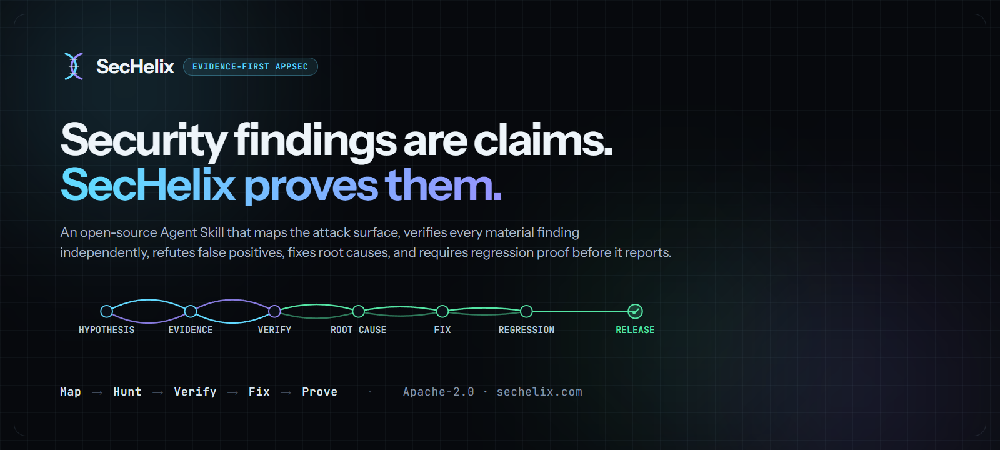

<p align="center">
  
</p>

<p align="center">
  <strong>Security findings are claims. SecHelix proves them.</strong><br/>
  Evidence-first AppSec Agent Skill with independent verification, false-positive refutation, root-cause remediation, and regression proof.
</p>

<p align="center">
  <a href="https://github.com/omarmohelal/SecHelix/actions/workflows/validate.yml"></a>
  <a href="LICENSE"></a>
  <a href="CHANGELOG.md"></a>
  <a href="https://skills.sh/omarmohelal/SecHelix"></a>
</p>

<p align="center">
  <a href="https://sechelix.com">Website</a> ·
  <a href="https://sechelix.com/docs">Docs</a> ·
  <a href="docs/QUICKSTART.md">Quickstart</a> ·
  <a href="docs/EVALUATION.md">Evaluation</a> ·
  <a href="docs/case-studies/gamingops-store-2026-09-01.md">Case study</a> ·
  <a href="SECURITY.md">Security policy</a>
</p>

---

## What SecHelix is

SecHelix is a **portable Agent Skill for application-security review**. Give it a repository, pull request, API, service, or authorized environment and it drives an evidence pipeline rather than a one-shot "find vulnerabilities" prompt:

```text
Scope + authorization
        ↓
Attack-surface map
        ↓
Applicability engine ──→ APPLICABLE / NOT_APPLICABLE / UNKNOWN / BLOCKED
        ↓
Parallel specialist hunting
        ↓
Candidate registry
        ↓
Independent verifier ──→ VERIFIED / FALSE_POSITIVE / LIKELY_BUT_UNPROVEN / BLOCKED_BY_ENVIRONMENT
        ↓
Root-cause fix + regression proof
        ↓
Release gate ──→ PASS / PASS_WITH_KNOWN_RISK / BLOCKED / INCOMPLETE
```

It covers classic AppSec, authorization and business logic, dependencies and secrets, infrastructure and cloud, plus AI/agent/MCP security. Scanner output is **candidate evidence**, not truth. High and Critical findings are not reportable until an independent verifier can reconstruct the evidence chain.

SecHelix is not a replacement for Semgrep, CodeQL, Trivy, OSV, ZAP, Playwright, or your coding agent. It is the **reasoning, verification, and decision layer above them**.

## Why it exists

AI coding agents can review a lot of code quickly, but security review fails when speed is confused with evidence. A model can confidently flag a harmless pattern, miss an authorization path spread across files, call a CVE exploitable without proving reachability, or "fix" a symptom while leaving the root cause alive elsewhere.

SecHelix treats every security claim as a hypothesis with explicit proof obligations:

- **attacker control** — can an attacker influence the input or state?
- **reachability** — can that input reach the sensitive operation in the deployed path?
- **boundary failure** — what policy or invariant actually fails?
- **safe reproduction** — can the behavior be demonstrated without destructive testing?
- **impact** — what does the failure let the attacker do?
- **preconditions** — what must already be true?
- **root cause** — what class-level design or implementation mistake created the failure?

That evidence chain is why a scanner hit does not automatically become a finding.

## Install

### Agent Skills CLI

```bash
npx skills@latest add omarmohelal/SecHelix --skill sechelix
```

This installs the portable bundle rather than the whole repository.

### Claude Code plugin

```text
/plugin marketplace add omarmohelal/sechelix-marketplace
/plugin install sechelix@sechelix-marketplace
```

### Manual / any compatible coding agent

Copy `skills/sechelix/` into the agent-readable skill location for your host, or point the agent directly at:

```text
skills/sechelix/SKILL.md
```

The portable bundle is self-contained and standard-library-only. See the evidence-backed [compatibility matrix](docs/reference/compatibility.md) before claiming a host integration is verified.

## Quick start

Ask your coding agent:

```text
Use SecHelix for a complete authorized security audit of this repository.
Start STATIC. Map the architecture, attack surface, data flows, trust boundaries,
authentication and authorization model first. Evaluate only applicable hypotheses.
Use scanners as evidence sources, not verdicts. Independently verify High/Critical
candidates, explicitly record false positives and blocked checks, fix root causes,
add regression proof, retest, and produce the final SecHelix release gate.
```

Useful focused requests:

```text
Use SecHelix to audit authorization, tenant isolation, BOLA/IDOR, role escalation,
and business-logic abuse. Build the authorization matrix and run two-user tests
where LOCAL or STAGING authorization permits them.
```

```text
Use SecHelix to review MCP and AI/agent security: prompt injection, tool authority,
confused-deputy paths, unsafe writes, cross-tool data flow, secret propagation,
agent memory, RAG isolation, and untrusted tool/resource/prompt metadata.
```

```text
Use SecHelix for a differential security review of this pull request. Classify each
security-relevant change as NEW_RISK, RISK_REDUCED, UNCHANGED, or UNKNOWN, then
independently verify material new-risk hypotheses before reporting them.
```

## Architecture at a glance

| Layer | What ships |
|---|---|
| Canonical skill | `skills/sechelix/SKILL.md` |
| Hypothesis catalog | **546 explicit IDs** = 21 security families × 26 verification lenses |
| Specialist roles | **17** role profiles, including an independent verifier |
| Contracts | **15 JSON Schema Draft 2020-12** schemas |
| Applicability | Deterministic four-state engine: `APPLICABLE / NOT_APPLICABLE / UNKNOWN / BLOCKED` |
| Evidence adapters | Semgrep, **Opengrep**, CodeQL/SARIF, OSV, Gitleaks, Trivy, npm/pnpm audit, Playwright, ZAP, Nuclei |
| Gold Check Packs | **18** deep packs with sources, FP filters, verification, remediation, regression, mappings, and calibration state |
| Knowledge engine | **76 nodes / 100 edges**, source registry, provenance, freshness, 11 lesson cards |
| Reporting | Markdown · redacted JSON · SARIF 2.1.0 · standalone escaped HTML |
| Release states | `PASS / PASS_WITH_KNOWN_RISK / BLOCKED / INCOMPLETE` |
| Change review | **Differential security review** — classifies a diff into `NEW_RISK` / `RISK_REDUCED` / `UNCHANGED` / `UNKNOWN` |
| V4 evidence runtime | **Optional stdlib-only runner `0.1.0`** — deterministic reasoner DAG, least-context routing, budget governor, coverage ledger, replay, loopback API and MCP |
| Bounded runtime proof | **LOCAL-only** IDOR, traversal, race/idempotency, webhook and SSRF proof executors; literal loopback only, no ambient proxy/redirect following, and no automatic finding promotion |
| Protocol / native lanes | Applicability-gated GraphQL, WebSocket, gRPC, OAuth/OIDC, SAML, JWT, webhook and HTTP proxy/cache review plus candidate-only C/C++/Rust source analysis |
| Full-workflow Arena | **Protocol shipped; result still `NOT_MEASURED`** — complete packet coverage, pinned versions, independent assessment and uncontaminated evidence are required before publication |

## The hypothesis catalog

The catalog is intentionally **frozen at 546 stable IDs**. Every ID combines one security family with one verification lens so tools and reports can refer to the same check without inventing names per run.

Examples of families:

```text
Authentication / identity
Authorization / BOLA / BFLA / tenant isolation
Sessions / cookies / JWT / CSRF
Business logic / money / inventory / state machines
Injection / dangerous sinks
Browser / DOM / CORS / messaging
Files / uploads / parsers / deserialization
SSRF / outbound requests / webhooks
Dependencies / supply chain
Cloud / IAM / storage / serverless / containers
AI / LLM / RAG / agents / MCP
```

Examples of lenses:

```text
Attack surface
Attacker control
Reachability
Boundary invariant
Compensating controls
Negative-space / false-positive refutation
Runtime proof
Regression proof
Variant analysis
Release gate
```

A catalog entry is a **question**, not a vulnerability. Applicability and evidence decide whether it matters for a target.

## Independent verification

The independent verifier's job is to **disprove** the candidate.

For a High/Critical finding, the verifier receives:

- the claim;
- affected surfaces;
- observations and raw evidence references;
- the required evidence-chain fields;
- the proposed impact.

It does **not** receive the hunter's conclusion as something to defend. The verifier must be able to produce:

```text
VERIFIED
FALSE_POSITIVE
LIKELY_BUT_UNPROVEN
DUPLICATE_ROOT_CAUSE
BLOCKED_BY_ENVIRONMENT
```

A second model saying "I agree" is not independent proof. Evidence has to survive reconstruction.

## Authorization and business logic

SecHelix treats authorization and business logic as first-class security surfaces, not edge cases after SAST.

Authorization review builds a graph and a matrix around:

```text
identity → role → permission → resource → action → enforcement point
```

Two-user controls matter. A route that correctly returns Alice's object to Alice proves nothing about Bob's ability to request it. The workflow asks for object substitution, tenant switching, inherited roles, UI-only gates, server-side policy conflicts, RLS behavior, wildcard grants, and missing enforcement edges.

Business-logic review asks questions scanners usually cannot answer:

```text
who may perform this action?
how many times?
in what order?
with whose object?
at whose price?
under which state transition?
what happens on retry, timeout, partial success, or concurrent execution?
```

Useful race/state pairs include:

```text
refund + late provider success
delivery + cancellation
cost edit + finalized payout
two admins + one assignment
timeout + retry + delayed callback
partial fulfillment + "mark full"
seller A + seller B's object
```

SecHelix treats exact-once behavior, state machines, accounting truth, retries, and race windows as security surfaces.

### Runtime proof can outrank static confidence

A typecheck can be green while the browser flow is broken. Unit tests can be green while a real database constraint or authorization boundary behaves differently. SecHelix can require browser, API, database, migration, or local-runtime proof at the layer where the invariant exists.

### AI-built code gets normal AppSec scrutiny

"Built with AI" is not itself a vulnerability class. SecHelix checks the actual implementation for missing server-side authorization, client-controlled identity/price fields, dynamic queries, unsafe HTML, SSRF, weak upload validation, permissive CORS, home-grown auth/JWT logic, missing replay/idempotency controls, unsafe logs, source-map exposure, overprivileged agent tools, and related failure modes.

## Safe execution modes

| Mode | Intended use | Dynamic traffic |
|---|---|---|
| `STATIC` | source/config/schema review | none |
| `LOCAL` | local app + fixtures | local only |
| `STAGING` | explicitly authorized non-production environment | allowlisted |
| `PRODUCTION_SAFE` | bounded non-destructive verification | tightly restricted |

> [!WARNING]
> SecHelix is for systems you own or are explicitly authorized to test. It does not turn code review into uncontrolled internet scanning, credential theft, persistence, destructive payloads, malware, or denial-of-service testing.

See [SECURITY.md](SECURITY.md).

## Evaluation and proof status

**The first uncontaminated blind-label run is now recorded.** It was produced on 2026-09-02 by 76 independent headless processes, each launched from an empty directory holding only `cases.json`. None cloned the repository or saw a label, a rationale, a pairing, or how many cases were vulnerable.

| Metric | Value |
|---|---|
| Precision | **0.950** |
| Detection recall | **1.000** |
| False-positive rate | **0.053** |
| False-positive rejection rate | **0.947** |
| Counts | **TP 38 · FP 2 · TN 36 · FN 0** |

> [!WARNING]
> **This is a label-only synthetic evaluation, not measured performance of the complete SecHelix workflow.** The protocol asks one question per file and takes one label back. It did not run attack-surface mapping, the independent refutation pass, adapters, evidence-chain construction, remediation, regression proof, or the release gate.

Raw result: [`evals/results/claude-sonnet-5-blind-2026-09-02.json`](evals/results/claude-sonnet-5-blind-2026-09-02.json). Full write-up, including every limitation: [`docs/research/evaluation-report.md`](docs/research/evaluation-report.md). The procedure anyone can repeat is [`evals/blind-packet/RUN.md`](evals/blind-packet/RUN.md).

**What is still `NOT_MEASURED`.** `verified_precision` is `0.0` because `verification_status` was `NOT_RUN` for every case — the procedure never asked for verification. `applicability_accuracy`, `regression_proof_rate` and `release_gate_accuracy` remain the literal string `NOT_MEASURED`; they belong to a full audit run, not to label-only scoring, and [`evals/results/not-measured.json`](evals/results/not-measured.json) still stands for them.

**The harness itself is validated separately.** [`evals/results/baseline-keyword-v1.json`](evals/results/baseline-keyword-v1.json) records a naive regex keyword matcher run against all 76 cases. It carries `"result_kind": "HARNESS_BASELINE"` and `"is_sechelix_result": false` and **is not a SecHelix score.** It lands at chance (precision 0.511, recall 0.632, FP rate 0.605) on a balanced 38/38 split, which is a statement about fixture difficulty and nothing else.

Metrics are defined in **[docs/EVALUATION.md](docs/EVALUATION.md)**. A public score is allowed only after a reproducible run records the exact SecHelix commit, fixture version, model/provider configuration, enabled tools, observed outcomes, and supporting artifacts — which is why the run above is published with its provenance and its seven recorded limitations attached.

## Limitations

Read this before adopting.

- **One blind label-suite measurement exists; no full-workflow benchmark exists.** The numbers above describe one model answering one question per file. Nothing measures the verifier, the adapters, remediation, regression proof, or the release gate.
- **One model, one run.** No repeats, no seed control, no variance estimate. A second run would not necessarily produce the same labels.
- **A balanced, authored suite.** 38 pairs, 38/38 vulnerable/clean — not a real base rate, where clean code vastly outnumbers vulnerable code. Precision on this suite overstates precision in the field.
- **Mostly single-file, mostly Python, synthetic.** Real vulnerabilities often span modules; these do not. The fixtures encode one team's idea of what is hard.
- **One case study, `n = 1`.** A ~600 LOC app with no authentication and no server-side state, audited by its own owner. It demonstrates the workflow; it measures nothing about general performance.
- **No public third-party results.** The [trophy case](docs/research/trophy-case.md) is empty on purpose.
- **Alpha.** `4.0.0-alpha.1`. Contracts and runtime interfaces are versioned, but they can still change.
- **SecHelix is a methodology, not a scanner.** Output quality depends on the host agent, the model, and the tools you enable. It does not run itself.
- **It cannot verify what it cannot reach.** Missing evidence yields `UNKNOWN` or `BLOCKED`, never `NOT_APPLICABLE`. That is the design, but it means an under-instrumented run returns honest non-answers rather than coverage.
- **Authorized targets only.** See [SECURITY.md](SECURITY.md).

## Can my company use it?

Yes — Apache-2.0, and the repository is standard-library Python with no runtime dependencies to vet.

- **Nothing phones home.** No telemetry, no accounts, no network calls in the skill bundle or the validators.
- **Your code stays where your agent runs.** SecHelix ships instructions, schemas, and local scripts; it adds no data path of its own.
- **Default mode is `STATIC`.** Dynamic testing is opt-in and bounded.
- **It composes rather than replaces.** Existing SAST/SCA/DAST output is consumed as *evidence*, not as findings.

Recommended rollout:

1. baseline one representative service;
2. measure verified findings and rejected false positives;
3. add organization-specific policy and trust-boundary invariants;
4. gate verified High/Critical regressions in CI;
5. keep `UNKNOWN`/`BLOCKED` visible and fail closed where evidence is required;
6. measure precision, recall on known fixtures, time to verification, regression-proof rate, and recurrence.

Full guide: **[docs/ENTERPRISE-ADOPTION.md](docs/ENTERPRISE-ADOPTION.md)** · commercial boundary: [COMMERCIAL.md](docs/business/commercial.md)

## Model mesh

Different models can own different lanes without creating different security policy.

| Lane | Role |
|---|---|
| Mapper | architecture, entrypoints, trust boundaries |
| Authorization specialist | roles, ownership, BOLA/BFLA, fail-open paths |
| Business-logic specialist | money, inventory, refunds, retries, partial success |
| Variant hunter | sibling paths and repeated unsafe patterns |
| Runtime verifier | browser/API/DB/test evidence |
| Independent verifier | reconstructs and tries to disprove important findings |

**Model reputation never replaces evidence.**

## Documentation

- [Command recipes](docs/reference/command-recipes.md) — one instruction per review lane
- [Repository map](docs/reference/repository-map.md) — what lives where
- [Status vocabulary](docs/reference/status-vocabulary.md) — what `UNKNOWN`, `BLOCKED`, `VERIFIED`, `NOT_MEASURED`, and other SecHelix states actually assert
- [Zero-trust repository mode](docs/reference/untrusted-repo-mode.md) — auditing a hostile repository
- [AI, agent, and MCP security](docs/reference/ai-agent-security.md) — mechanisms, and what evidence refutes each one
- [Specialist agents](docs/reference/specialist-agents.md) — the 17 role profiles

**Evidence and decisions**

- [Policy packs](docs/reference/policy-packs.md) — release rules as versioned data, stamped into the report they decided
- [Verifier quorum](docs/reference/verifier-quorum.md) — independent verification paths that cannot see each other
- [Calibration](docs/reference/calibration.md) — does stated confidence predict the verifier's verdict
- [Proof bundles](docs/reference/proof-bundles.md) — one verified finding, exported so a recipient can check it
- [Campaigns](docs/reference/campaigns.md) — grouping findings by root cause so remediation is finite
- [Remediation loop](docs/reference/remediation-loop.md) — reviewing the fix as adversarially as the bug

**Analysis surfaces**

- [Runtime trace](docs/reference/runtime-trace.md) — correlating runtime observations with static evidence
- [Dependency exploitability](docs/reference/dependency-exploitability.md) — why a CVE being present is not enough
- [Secret lifecycle](docs/reference/secret-lifecycle.md) — detection is the easy part
- [MCP permission graph](docs/reference/mcp-permission-graph.md) — agent, server, tool, permission, data
- [AI-BOM](docs/reference/ai-bom.md) — inventory for an AI-enabled repository
- [Authorization graph](docs/reference/authorization-graph.md) — identity to role to permission to resource