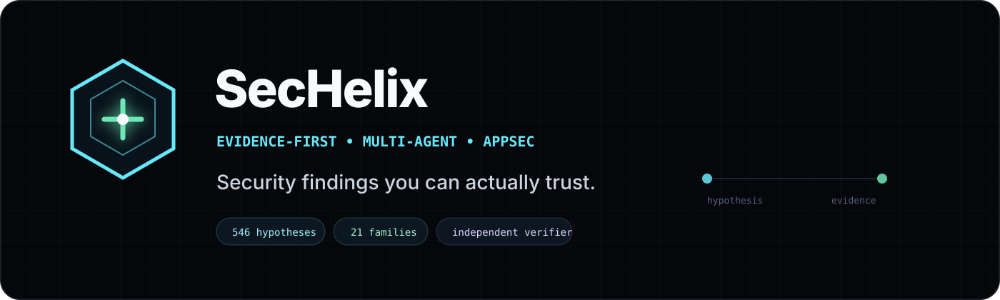
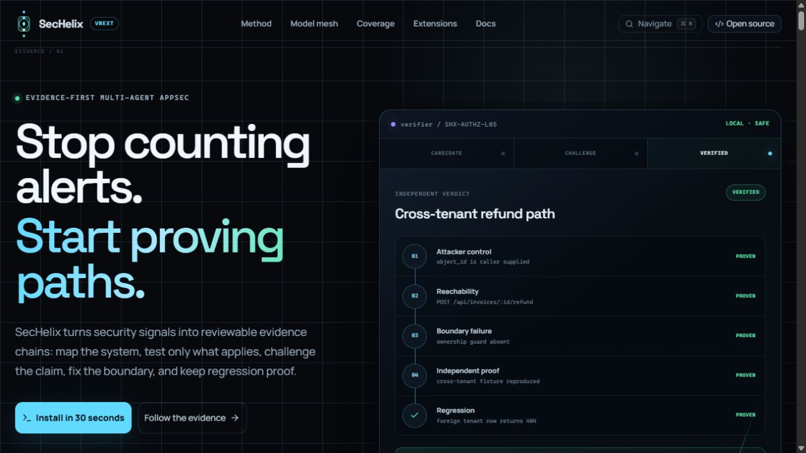
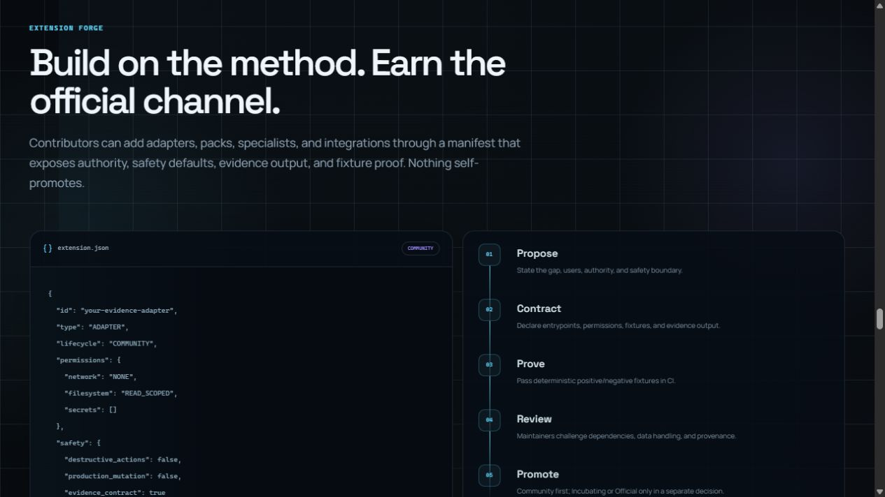

<p align="center">
  
</p>

<p align="center">
  <strong>Multi-agent application security that verifies before it accuses.</strong><br/>
  Map the attack surface → hunt in parallel → independently verify → fix the root cause → prove the regression.
</p>

<p align="center">
  <a href="https://skills.sh/omarmohelal/SecHelix"></a>
  <a href="https://github.com/omarmohelal/SecHelix/actions"></a>
  <a href="SKILL.md"></a>
  <a href="CHANGELOG.md"></a>
  <a href="LICENSE"></a>
  <a href="https://sechelix.magnoumx.chatgpt.site/support"></a>
</p>

<p align="center">
  <a href="#install-in-30-seconds">Install</a> ·
  <a href="#how-it-works">How it works</a> ·
  <a href="#coverage">Coverage</a> ·
  <a href="#model-mesh">Model mesh</a> ·
  <a href="#company-rollout">Companies</a> ·
  <a href="ROADMAP.md">Roadmap</a> ·
  <a href="https://sechelix.magnoumx.chatgpt.site">Website</a> ·
  <a href="https://sechelix.magnoumx.chatgpt.site/support">Support</a>
</p>

---

## What is SecHelix?

SecHelix is an **evidence-first AppSec skill and orchestration methodology** for repositories and environments you are authorized to test.

It is intentionally not “an AI scanner with 500 payloads.” Instead, it coordinates code-reading agents, security tools, browser/runtime evidence, and an independent verifier under one shared standard.

> [!IMPORTANT]
> A scanner alert is not a vulnerability.  
> A model suspicion is not a vulnerability.  
> Two models agreeing is not independent proof.

A finding becomes trusted only when the evidence supports attacker control, reachability, a failed security boundary, a safe reproduction, concrete impact, root cause, and regression proof.

### What ships in VNext

| Surface | Current state |
|---|---|
| Coverage | **546 explicit, stable hypothesis IDs** across 21 families and 26 lenses |
| Specialist mesh | **17 model-neutral role profiles**, including an independent verifier |
| Contracts | **14 JSON Schema Draft 2020-12 contracts** from scope/report through extensions, source trust, graph, lessons, and research |
| Knowledge engine | Rights-aware source registry, deterministic live-research confidence, provenance graph, and lesson-card seed |
| Evidence adapters | Semgrep, CodeQL/SARIF, OSV, Gitleaks, Trivy, npm/pnpm audit, Playwright, ZAP, Nuclei |
| Reports | Markdown, redacted JSON, SARIF 2.1.0, escaped standalone HTML |
| Release truth | `PASS`, `PASS_WITH_KNOWN_RISK`, `BLOCKED`, or fail-closed `INCOMPLETE` |
| Evals | Eight vulnerable/clean fixture families; public aggregate results are **NOT_MEASURED** |

### VNext product preview

The product site authoring source is private; these selected, source-free
screenshots are published intentionally so the public framework has an honest
visual preview. [Open the current SecHelix site →](https://sechelix.magnoumx.chatgpt.site)

<p align="center">
  
</p>

<p align="center">
  
</p>

## Install in 30 seconds

### Recommended — skills CLI

```bash
npx skills@latest add omarmohelal/SecHelix --skill sechelix
```

Then tell your coding agent:

```text
Run a SecHelix security audit on this repository.
Start with scope and attack-surface mapping.
Only execute applicable checks.
Independently verify every High/Critical finding before reporting it.
```

<details>
<summary><strong>Claude Code</strong></summary>

```bash
npx skills@latest add omarmohelal/SecHelix --skill sechelix
```

Or copy the project-local adapter:

```bash
mkdir -p .claude/skills
cp -R skills/sechelix .claude/skills/sechelix
```

</details>

<details>
<summary><strong>OpenAI Codex</strong></summary>

```bash
npx skills@latest add omarmohelal/SecHelix --skill sechelix
```

The repository also ships a `.codex/skills/sechelix/` adapter.

</details>

<details>
<summary><strong>Z.AI / GLM</strong></summary>

SecHelix stays model-agnostic. Run GLM inside a supported coding host (Claude Code, Cursor, OpenCode, Cline, etc.) and install the skill through that host's skill loader.

Use `skills/sechelix/` as the vendor-neutral source of truth.

</details>

<details>
<summary><strong>Cursor / Copilot / other Agent Skills clients</strong></summary>

Use:

```bash
npx skills@latest add omarmohelal/SecHelix --skill sechelix
```

If your host has no installer, copy `skills/sechelix/` into its documented Agent Skills directory.

See [COMPATIBILITY.md](COMPATIBILITY.md).

</details>

## How it works

```text
                 ┌──────────────────────────────┐
                 │          SCOPE               │
                 │ authorization + stop rules   │
                 └──────────────┬───────────────┘
                                ↓
      ┌──────────────────────────────────────────────────┐
      │ MAP identities • assets • entrypoints • states  │
      │ trust boundaries • roles • providers • data     │
      └──────────────────────┬───────────────────────────┘
                             ↓
            select APPLICABLE hypotheses only
                             ↓
             resolve CURRENT / UNKNOWN claims
             rights gate • 2-source research
                             ↓
      ┌──────────┬──────────┬──────────┬──────────┐
      │ Auth/Z   │ Web/API  │ Logic    │ Races    │  ...
      │ reviewer │ reviewer │ reviewer │ reviewer │
      └────┬─────┴────┬─────┴────┬─────┴────┬─────┘
           └──────────┴───────────┴──────────┘
                             ↓
                   INDEPENDENT VERIFIER
                   tries to refute claims
                             ↓
                    ROOT-CAUSE FIX
                             ↓
                    REGRESSION PROOF
                             ↓
                       RELEASE GATE
```

### Evidence standard

A verified vulnerability should establish:

1. **Attacker control**
2. **Reachability**
3. **Boundary failure**
4. **Safe reproduction**
5. **Concrete impact**
6. **Preconditions**
7. **Root cause**
8. **Fix**
9. **Regression proof**

High/Critical candidates get an independent refutation pass before final reporting.

## Model mesh

Different models can own different lanes without creating different security policies.

| Lane | Good fit | Role |
|---|---|---|
| Mapper | large-context model | architecture, entrypoints, trust boundaries |
| Authorization | strong reasoning model | role/object/action matrix, BOLA/BFLA, fail-open paths |
| Business logic | strong reasoning model | money, refunds, inventory, partial success, abuse cases |
| Variants | fast/cheap model | repeated-pattern and sibling-path hunting |
| Runtime | browser + DB + test tools | prove behavior rather than infer it |
| Verifier | **different model/provider** | reconstruct and try to disprove important findings |

SecHelix can sit above Claude, Codex, GLM, Gemini, Cursor-hosted models, and scanners. **Model reputation never replaces evidence.**

## Coverage

The catalog contains **546 structured security hypotheses across 21 families**.

| | | |
|---|---|---|
| Authentication | Sessions | Authorization / BOLA / BFLA |
| Injection | API security | Files / uploads |
| SSRF | Browser / client | Business logic |
| Payments / accounting | Race conditions / idempotency | Database / migrations / RPCs |
| Cryptography / secrets | Supply chain | CI/CD |
| Cloud / configuration | Privacy / logging | AI / Agent / MCP |
| Operational security | Release security | Attack-surface mapping |

SecHelix marks each hypothesis `APPLICABLE`, `NOT_APPLICABLE`, `UNKNOWN`, or `BLOCKED`. Missing evidence is never treated as absence, and an unauthorized scope is blocked rather than mislabeled inapplicable. It does **not** spray every check at every target.

### Knowledge without blind ingestion

Current security claims pass through a source registry that records authority,
publisher independence, license state, allowed uses, and refresh cadence. One
source creates a lead, not a fact. Two independent reputable sources produce
`SUPPORTED`; an exact-version official advisory can produce `HIGH_CONFIDENCE`;
only code evidence plus bounded safe reproduction produces `CONFIRMED`.

PortSwigger Web Security Academy, TryHackMe, and Hack The Box remain
`HUMAN_ONLY` references under their current terms—no autonomous retrieval,
copying, embeddings, training, evaluation, or benchmarking without separate
permission. See [the Knowledge Engine policy](references/knowledge-engine.md).

## Where SecHelix is different

### Business logic is first-class

Security bugs often live between individually valid actions:

```text
refund + late provider success
delivery + cancellation
cost edit + finalized payout
two admins + one assignment
timeout + retry + delayed callback
partial fulfillment + "mark full"
seller A + seller B's object
```

SecHelix treats exact-once, state machines, accounting truth, retries, and race windows as security surfaces.

### Noise gets challenged

Every important candidate can be routed to a verifier whose job is to **disprove** it. Compensation controls, unreachable states, role prerequisites, and impossible attacker inputs are valid reasons to reject a finding.

### Runtime proof can outrank static confidence

Typecheck can be green while the browser bundle is broken. Unit tests can be green while a database constraint rejects the real write. SecHelix can require build, browser, database, or migration proof at the layer where the invariant actually lives.

## Safe execution modes

| Mode | Intended use | Dynamic traffic |
|---|---|---|
| `STATIC` | source/config/schema review | none |
| `LOCAL` | local app + fixtures | local only |
| `STAGING` | authorized non-production environment | allowlisted |
| `PRODUCTION_SAFE` | bounded non-destructive verification | tightly restricted |

> [!WARNING]
> SecHelix is for systems you own or are explicitly authorized to test. It does not turn code review into uncontrolled internet scanning, credential theft, persistence, destructive payloads, or denial-of-service testing.

See [SECURITY.md](SECURITY.md).

## Repository layout

```text
SecHelix/
├── SKILL.md                    # canonical methodology
├── skills/sechelix/            # self-contained portable Agent Skills bundle
├── .claude/skills/sechelix/    # Claude Code adapter
├── .codex/skills/sechelix/     # Codex adapter
├── agents/                     # specialist reviewer profiles
├── catalog/                    # 546 explicit structured hypotheses
├── knowledge/                  # source trust, provenance graph, lesson cards
├── schemas/                    # versioned JSON contracts
├── sechelix_core/              # applicability, graph, catalog, contract core
├── adapters/                   # normalized tool evidence adapters
├── reports/                    # Markdown/JSON/SARIF/HTML renderer
├── policies/                   # public release-gate policy examples
├── references/                 # methodology + standards + tooling
├── scripts/                    # validation + release gates
├── examples/                   # scope + report examples
├── extensions/                 # curated community extension registry
├── evals/                      # paired fixtures + NOT_MEASURED baseline
├── docs/                       # rollout + design docs
├── assets/vnext-preview/       # selected source-free product screenshots
└── .github/                    # pinned CI + contribution templates
```

## Company rollout

SecHelix is designed so a company can keep the open methodology while adding private policy:

1. baseline one service;
2. measure verified findings and false positives;
3. add organization-specific trust boundaries and policy packs;
4. gate verified High/Critical findings in CI;
5. require browser/staging proof for critical workflows;
6. evaluate model/scanner performance on internal fixtures.

See [docs/company-rollout.md](docs/company-rollout.md) and [COMMERCIAL.md](COMMERCIAL.md).

## Validation

```bash
python -m unittest discover -s tests -v
python -m unittest discover -s adapters/tests -v
python scripts/validate_catalog.py
python scripts/validate_extensions.py
python scripts/validate_knowledge.py
python scripts/validate_skill.py
python scripts/check_no_secrets.py
python scripts/check_private_site_leakage.py
npx skills@latest add . --list
```

The repository validates catalog identity, source rights/use boundaries, knowledge
provenance, research confidence, the standalone install bundle, schemas,
adapters, reporting, policy gates, secrets, private-site separation, and
public-release invariants in GitHub Actions.

## Trophy case

SecHelix is young, so the trophy case starts empty **on purpose**. We will only list issues where the evidence is public and the project/maintainer permits attribution.

Found a real bug using SecHelix? Open an issue and include the safe public evidence.

See [TROPHY_CASE.md](TROPHY_CASE.md).

## Roadmap

Implemented in the VNext alpha:

- deterministic applicability and attack-surface graph contracts;
- SARIF, Semgrep, CodeQL, OSV, Trivy, Gitleaks, package-audit, browser, ZAP, and Nuclei adapters;
- paired vulnerable/clean eval fixtures with blind export and honest `NOT_MEASURED` results;
- canonical Markdown/JSON/SARIF/HTML reports and fail-closed policy gates;
- signed evidence-bundle, audit/retention, CI, and private-policy-pack designs.
- rights-aware source registry, deterministic live-research packets, and the
  first provenance-backed graph and lesson card.

Next work is rights-reviewed SARD/OWASP Benchmark ingestion, broader verified
graph/lesson coverage, reproducible benchmark runs, model/provider scorecards,
and design-partner evidence. No capability ranking is claimed before measurement.

See [ROADMAP.md](ROADMAP.md).

## Support the project

SecHelix is open source. Donations help fund model/API evals, intentionally vulnerable fixtures, scanner adapters, domain/hosting, and maintainer time.

**Official crypto addresses live only in the repository and the official SecHelix domain. Always verify the asset and network before sending.**

[Open the public support page →](https://sechelix.magnoumx.chatgpt.site/support)

The product-grade VNext website is maintained and built from a separate private
repository. This public repository contains the framework, intentionally
selected non-source previews, and a tiny GitHub Pages handoff—never the website
authoring source or source maps. As with every web application, the HTML, CSS,
and JavaScript delivered to a browser remain inspectable; the protected boundary
is the TypeScript/component source, build configuration, and source maps.

## Contributing

Contributions are welcome, especially:

- false-positive fixtures;
- vulnerable/clean eval pairs;
- security hypothesis proposals;
- source-registry reviews, verified graph mappings, and original lesson cards;
- scanner/SARIF adapters;
- company rollout feedback;
- documentation improvements.

Security checks should be proposed as **testable hypotheses**, not slogans.

### Build on SecHelix

The curated extension program accepts community adapters, catalog/eval/policy
packs, reporters, specialists, and integrations. Submissions carry a versioned
manifest with declared permissions, safe defaults, deterministic fixtures, and an
evidence-contract target. They enter the `COMMUNITY` channel; only maintainers can
promote proven work to `INCUBATING` or `OFFICIAL` in a separate review.

[Read the extension program →](docs/EXTENSIONS.md) ·
[Propose an extension →](https://github.com/omarmohelal/SecHelix/issues/new?template=extension.yml)

Read [CONTRIBUTING.md](CONTRIBUTING.md).

## License

Apache-2.0.

---

<p align="center">
  <strong>SecHelix</strong><br/>
  Verify before you accuse.
</p>
